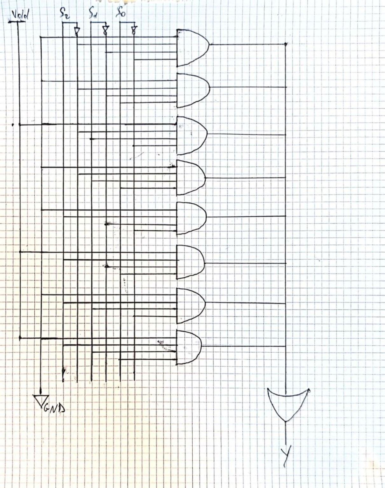

# Esercizio 1

Dimostrare, mediante passaggi algebrici, che:
$$
(A + B)(A + \overline{C})(\overline{A} + C) = AC + \overline{A}B\overline{C}
$$
Implementare inoltre la tabella di verità della funzione booleana tramite un multiplexer.

---

# Svolgimento

## Dimostrazione algebrica

**Passaggio 1** - **T8 Distributiva**: $(A + B)(A + \overline{C})$
$$
(A + B)(A + \overline{C}) = A \cdot A + A \cdot \overline{C} + B \cdot A + B \cdot \overline{C}
$$
$$
= A + A\overline{C} + AB + B\overline{C}
$$

**Passaggio 2** - **T6 Assorbimento**: $A + A\overline{C} = A$
$$
= A + AB + B\overline{C}
$$

**Passaggio 3** - **T6 Assorbimento**: $A + AB = A$
$$
= A + B\overline{C}
$$

**Passaggio 4** - Moltiplico per il terzo fattore: $(\overline{A} + C)$
$$
(A + B\overline{C})(\overline{A} + C)
$$

**Passaggio 5** - **T8 Distributiva**
$$
= A(\overline{A} + C) + B\overline{C}(\overline{A} + C)
$$
$$
= A\overline{A} + AC + B\overline{C}\overline{A} + B\overline{C}C
$$

**Passaggio 6** - **T5 Complementi**: $A\overline{A} = 0$ e $\overline{C}C = 0$, **T2 Identità**: $X + 0 = X$
$$
= 0 + AC + \overline{A}B\overline{C} + 0
$$
$$
= AC + \overline{A}B\overline{C}
$$

**QED** ✓

---

## Tabella di verità e implementazione MUX

| A | B | C | $(A+B)(A+\overline{C})(\overline{A}+C)$ | $AC + \overline{A}B\overline{C}$ |
|---|---|---|------------------------------------------|-----------------------------------|
| 0 | 0 | 0 | 0                                        | 0                                 |
| 0 | 0 | 1 | 0                                        | 0                                 |
| 0 | 1 | 0 | 1                                        | 1                                 |
| 0 | 1 | 1 | 0                                        | 0                                 |
| 1 | 0 | 0 | 0                                        | 0                                 |
| 1 | 0 | 1 | 1                                        | 1                                 |
| 1 | 1 | 0 | 0                                        | 0                                 |
| 1 | 1 | 1 | 1                                        | 1                                 |

**Implementazione con MUX 8:1**
- **Selezioni**: $S_2 = A$, $S_1 = B$, $S_0 = C$
- **Ingressi**: $I_0 = 0$, $I_1 = 0$, $I_2 = 1$, $I_3 = 0$, $I_4 = 0$, $I_5 = 1$, $I_6 = 0$, $I_7 = 1$

La funzione vale 1 solo per le combinazioni: 010, 101, 111 (righe 2, 5, 7 della tabella).

## Schema circuitale MUX 8:1

**Configurazione per la funzione $AC + \overline{A}B\overline{C}$:**
- **Selezioni**: $S_2 = A$, $S_1 = B$, $S_0 = C$  
- **Ingressi**: $I_0 = 0$, $I_1 = 0$, $I_2 = 1$, $I_3 = 0$, $I_4 = 0$, $I_5 = 1$, $I_6 = 0$, $I_7 = 1$

**Funzionamento:**
- ABC = 010 → seleziona $I_2 = 1$ → Y = 1 ✓
- ABC = 101 → seleziona $I_5 = 1$ → Y = 1 ✓  
- ABC = 111 → seleziona $I_7 = 1$ → Y = 1 ✓
- Tutte le altre combinazioni → Y = 0