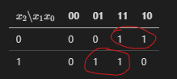

# Esercizio

Progettare una rete combinatoria con **3 ingressi** ($x_2$, $x_1$, $x_0$) e un'unica **uscita** `Y`, tale che:

- `Y = 1` se il numero binario rappresentato dagli ingressi è **un numero primo** (tra 0 e 7).
- `Y = 0` altrimenti.

Richiesto:
1. Determinare la tabella di verità.
2. Scrivere la funzione nella forma canonica **SOP**.
3. Semplificare con mappa di **Karnaugh**.
4. Disegnare lo schema circuitale risultante.

# Svolgimento

## Soluzione Punto 1: Tabella di Verità

Gli ingressi sono $x_2$, $x_1$, $x_0$, che rappresentano un numero binario da 0 a 7. L'uscita `Y` è 1 se il numero è primo (2, 3, 5, 7) e 0 altrimenti.

| $x_2$ | $x_1$ | $x_0$ | Numero decimale | Primo? | `Y` |
|-------|-------|-------|-----------------|--------|-----|
|   0   |   0   |   0   |        0        |   No   |  0  |
|   0   |   0   |   1   |        1        |   No   |  0  |
|   0   |   1   |   0   |        2        |   Sì   |  1  |
|   0   |   1   |   1   |        3        |   Sì   |  1  |
|   1   |   0   |   0   |        4        |   No   |  0  |
|   1   |   0   |   1   |        5        |   Sì   |  1  |
|   1   |   1   |   0   |        6        |   No   |  0  |
|   1   |   1   |   1   |        7        |   Sì   |  1  |

## Soluzione Punto 2: Forma Canonica SOP

La forma canonica SOP (Sum of Products) si ottiene sommando i mintermini per cui l'uscita `Y` è uguale a 1. 

Dalla tabella di verità, vediamo che `Y = 1` per i numeri decimali 2, 3, 5 e 7. Scriviamo i mintermini corrispondenti:

- Per il numero 2 ($x_2=0$, $x_1=1$, $x_0=0$): $\overline{x_2}x_1\overline{x_0}$
- Per il numero 3 ($x_2=0$, $x_1=1$, $x_0=1$): $\overline{x_2}x_1x_0$
- Per il numero 5 ($x_2=1$, $x_1=0$, $x_0=1$): $x_2\overline{x_1}x_0$
- Per il numero 7 ($x_2=1$, $x_1=1$, $x_0=1$): $x_2x_1x_0$

Sommiamo i mintermini per ottenere la funzione canonica SOP:
$$
Y = \overline{x_2}x_1\overline{x_0} + \overline{x_2}x_1x_0 + x_2\overline{x_1}x_0 + x_2x_1x_0
$$

## Soluzione Punto 3: Semplificazione con Mappa di Karnaugh

### Costruzione della K-map

Per 3 variabili ($x_2$, $x_1$, $x_0$), usiamo una tabella 2×4:
- **Righe**: $x_2$ (0 o 1)
- **Colonne**: $x_1x_0$ con ordine **Gray Code**: 00, 01, 11, 10

**IMPORTANTE**: L'ordine delle colonne non è 00, 01, 10, 11 ma **00, 01, 11, 10**. Questo è fondamentale perché tra colonne adiacenti cambia solo una variabile, permettendo i raggruppamenti!

Riportiamo i valori di `Y` dalla tabella di verità:

| $x_2 \backslash x_1x_0$ | 00  | 01  | 11  | 10  |
|--------------------------|------|------|------|------|
| 0                        |  0   |  0   |  1   |  1   |
| 1                        |  0   |  1   |  1   |  0   |

### Regole di Raggruppamento

1. **Dimensioni dei gruppi**: solo 1, 2, 4, 8, 16... celle (potenze di 2)
2. **Adiacenza**: celle fisicamente vicine o ai bordi opposti (la mappa "si avvolge")
3. **Forma**: i gruppi devono essere rettangolari
4. **Sovrapposizioni**: i gruppi possono sovrapporsi
5. **Obiettivo**: coprire tutti gli '1' con il minor numero di gruppi più grandi possibili

### Identificazione dei Gruppi

Analizziamo la nostra K-map:

**[Gruppo A]** (celle (0,11) e (0,10)):
- Adiacenti orizzontalmente [OK]
- Gruppo di dimensione 2 [OK]
- Analisi delle variabili:
  - $x_2 = 0$ in entrambe le celle → **si mantiene** come $\overline{x_2}$
  - $x_1 = 1$ in entrambe le celle → **si mantiene** come $x_1$
  - $x_0 = 1$ nella prima cella, $x_0 = 0$ nella seconda → **si elimina** perché cambia valore
- **Termine**: $\overline{x_2}x_1$ (la variabile $x_0$ è eliminata perché assume valori diversi nel gruppo)

**[Gruppo B]** (celle (1,01) e (1,11)):
- Adiacenti orizzontalmente [OK]
- Gruppo di dimensione 2 [OK]
- Analisi delle variabili:
  - $x_2 = 1$ in entrambe le celle → **si mantiene** come $x_2$
  - $x_1 = 0$ nella prima cella, $x_1 = 1$ nella seconda → **si elimina** perché cambia valore
  - $x_0 = 1$ in entrambe le celle → **si mantiene** come $x_0$
- **Termine**: $x_2x_0$ (la variabile $x_1$ è eliminata perché assume valori diversi nel gruppo)

### Funzione Semplificata

Combinando i due gruppi otteniamo:
$$
Y = \overline{x_2}x_1 + x_2x_0
$$

## Soluzione Punto 4: Schema Circuitale
