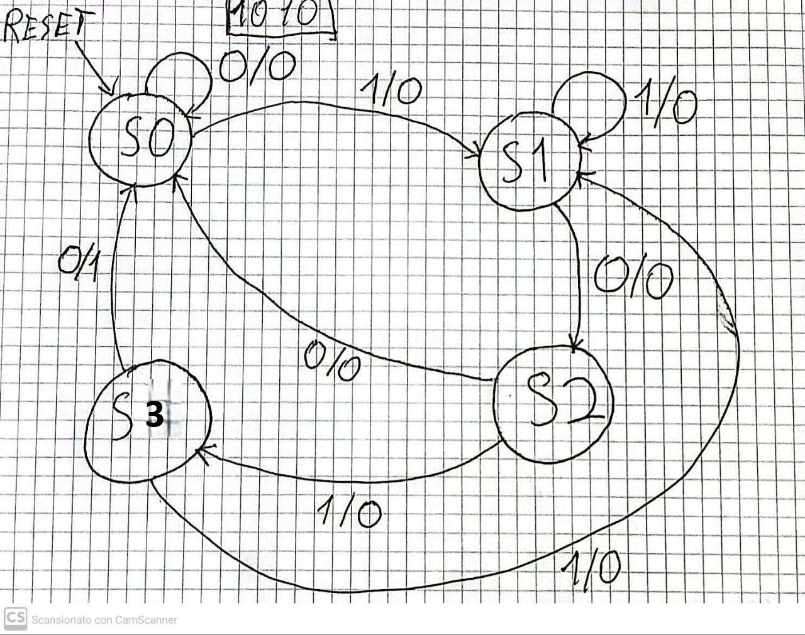

# Esercizio

Sintetizzare una **macchina a stati finiti di Mealy** con:

- Ingresso binario: `X`
- Uscita binaria: `Y`

La macchina deve riconoscere la sequenza `1010`.

- L'uscita è alta (`Y = 1`) solo nel momento in cui in ingresso si presenta la sequenza completa `1010`.

Richiesto:

1. Grafo degli stati (**STG**)
2. Tabella di transizione (**STT**)
3. Tabella di transizione codificata
4. Struttura circuitale del sistema completo, semplificando le funzioni.

## Soluzione

### 1. Grafo degli stati (**STG**)

#### Descrizione del grafo disegnato:

**Stati utilizzati:**

- **S0**: Stato iniziale (nessun progresso nella sequenza)
- **S1**: Riconosciuto prefisso "1" 
- **S2**: Riconosciuto prefisso "10"
- **S3**: Riconosciuto prefisso "101"

**Transizioni e logica di funzionamento:**

- **Da S0**: Input 0 mantiene lo stato (0/0→S0), input 1 inizia la sequenza (1/0→S1)
- **Da S1**: Input 0 avanza a "10" (0/0→S2), input 1 rimane su "1" (1/0→S1)
- **Da S2**: Input 0 non forma prefisso valido (0/0→S0), input 1 avanza a "101" (1/0→S3)
- **Da S3**: Input 0 completa "1010" con uscita attiva (0/1→S2), input 1 torna a prefisso "1" (1/0→S1)

**Caratteristiche del progetto:**

- **Macchina di Mealy**: Uscite dipendenti da stato E input
- **Uscita Y=1**: Solo sulla transizione S3→S2 con input 0
- **Gestione sequenze sovrapposte**: Transizione S3→S1 con input 1 mantiene il prefisso "1"
- **Reset implicito**: Freccia RESET verso S0
- **Completezza**: Tutte le combinazioni stato-input sono definite

**Verifica di correttezza:**
Il grafo è **corretto e completo**. Riconosce la sequenza "1010" attivando l'uscita Y=1 esattamente quando richiesto, gestendo correttamente anche sequenze sovrapposte come "101010".

### 2. Tabella di transizione (STT)

**Tabella di transizione con stati simbolici:**

| Input | Present State (PS) | Next State (NS) | Output |
|:-----:|:------------------:|:---------------:|:------:|
|   X   |        PS          |       NS        |   Y    |
|   0   |        S0          |       S0        |   0    |
|   0   |        S1          |       S2        |   0    |
|   0   |        S2          |       S0        |   0    |
|   0   |        S3          |       S2        |   **1**|
|   1   |        S0          |       S1        |   0    |
|   1   |        S1          |       S1        |   0    |
|   1   |        S2          |       S3        |   0    |
|   1   |        S3          |       S1        |   0    |

**Caratteristiche della STT:**
- 8 righe per tutte le combinazioni possibili (4 stati × 2 input)
- L'uscita Y=1 appare **solo** quando si completa la sequenza "1010" (riga S3 + input 0)
- Tutte le altre transizioni producono Y=0

### 3. Tabella di transizione codificata

**Codifica degli stati** con 2 bit (Q1 Q0):
- **S0** = 00 (stato iniziale)
- **S1** = 01 (prefisso "1")  
- **S2** = 10 (prefisso "10")
- **S3** = 11 (prefisso "101")

**Tabella di transizione codificata:**

| Input | Present State (PS) | Next State (NS) | Output |
|:-----:|:------------------:|:---------------:|:------:|
|   X   |     Q1    Q0       |     Q1    Q0    |   Y    |
|   0   |      0     0       |      0     0    |   0    |
|   0   |      0     1       |      1     0    |   0    |
|   0   |      1     0       |      0     0    |   0    |
|   0   |      1     1       |      1     0    |   **1**|
|   1   |      0     0       |      0     1    |   0    |
|   1   |      0     1       |      0     1    |   0    |
|   1   |      1     0       |      1     1    |   0    |
|   1   |      1     1       |      0     1    |   0    |